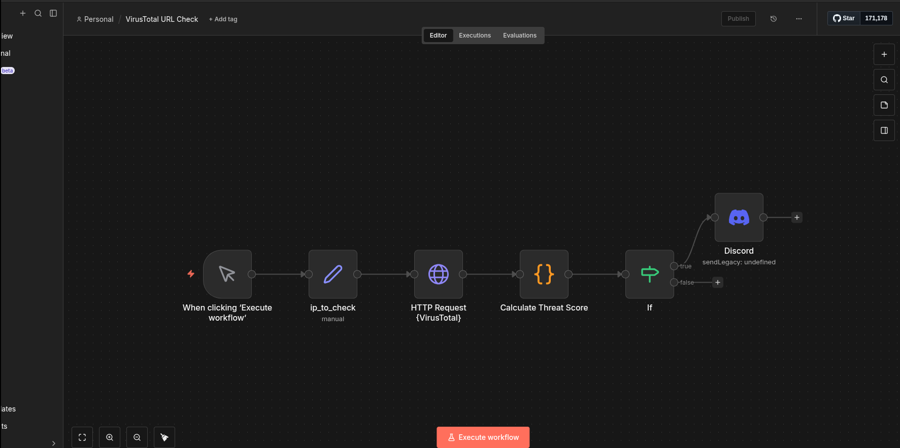
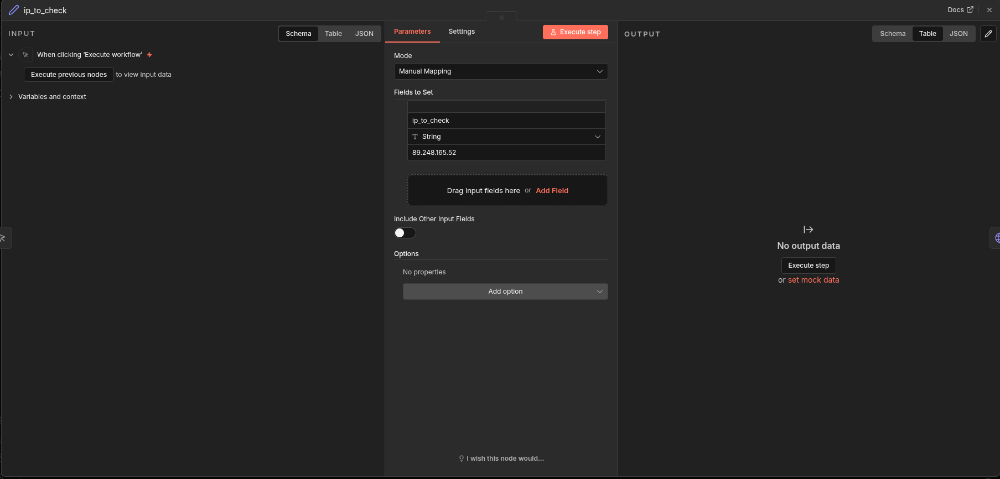
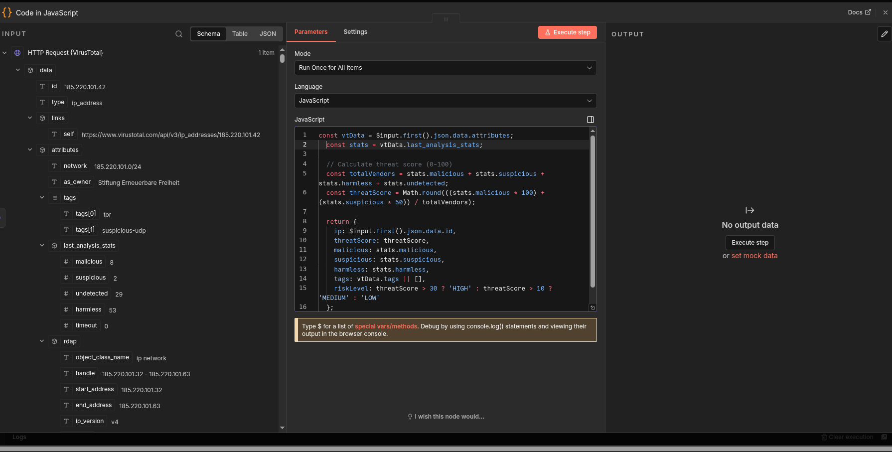
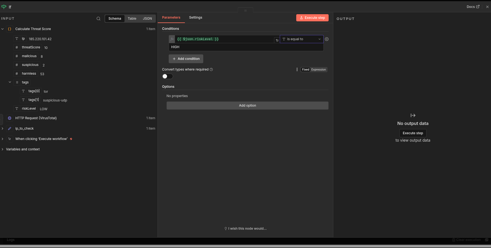

# IP Reputation Check Workflow

This workflow checks IP addresses against VirusTotal's threat intelligence database and sends Discord alerts for high-risk IPs.

## Workflow Overview

**Flow:** Manual Trigger → Set IP → VirusTotal API → Calculate Threat Score → IF (HIGH?) → Discord Alert



## Components

### 1. Manual Trigger
Initiates the workflow manually for testing. In production, this would be replaced with a webhook or scheduled trigger that receives IPs from other systems (email gateway, SIEM, etc.).

### 2. Set Node (ip_to_check)
Sets the IP address to analyze. This node can be modified to accept dynamic input from previous nodes or external sources.



### 3. HTTP Request (VirusTotal)
Calls the VirusTotal API v3 IP address endpoint.

**Endpoint:** `https://www.virustotal.com/api/v3/ip_addresses/{ip}`

**Authentication:** Header Auth with API key (`x-apikey`)


### 4. Calculate Threat Score (Code Node)
Processes the VirusTotal response and calculates a risk level based on malicious detection counts.

```javascript
const vtData = $input.first().json.data.attributes;
const stats = vtData.last_analysis_stats;

// Calculate threat score (0-100)
const totalVendors = stats.malicious + stats.suspicious + stats.harmless + stats.undetected;
const threatScore = Math.round(((stats.malicious * 100) + (stats.suspicious * 50)) / totalVendors);

// Risk level based on malicious detection count
let riskLevel;
if (stats.malicious >= 5) {
  riskLevel = 'HIGH';
} else if (stats.malicious >= 2) {
  riskLevel = 'MEDIUM';
} else {
  riskLevel = 'LOW';
}

return {
  ip: $input.first().json.data.id,
  threatScore: threatScore,
  malicious: stats.malicious,
  suspicious: stats.suspicious,
  harmless: stats.harmless,
  tags: vtData.tags || [],
  riskLevel: riskLevel
};
```



### 5. IF Node (Risk Level Check)
Routes the workflow based on risk level:
- **TRUE branch (HIGH):** Sends alert to Discord
- **FALSE branch (MEDIUM/LOW):** No action (could be extended for logging)

**Condition:** `riskLevel` equals `HIGH`



### 6. Discord Notification
Sends a formatted alert to a Discord channel via webhook when a HIGH risk IP is detected.

**Message Format:**
```
**IP Address:** {{ $json.ip }}
**Threat Score:** {{ $json.threatScore }}/100
**Risk Level:** {{ $json.riskLevel }}
**Malicious Detections:** {{ $json.malicious }}
**Suspicious Detections:** {{ $json.suspicious }}
```


## Threshold Tuning

### Initial Problem
The original implementation used a percentage-based threat score with thresholds:
- `threatScore > 30` = HIGH
- `threatScore > 10` = MEDIUM

This was **too insensitive** for real-world use. VirusTotal checks IPs against 80-90+ security vendors, so even clearly malicious IPs rarely exceed 30% detection rate.

**Example:** A known Tor exit node (185.220.101.42) with 8 malicious detections only scored ~10% on the percentage scale, resulting in a LOW classification despite being a known threat actor IP.

### Solution
Switched to raw malicious detection counts based on security analyst experience:

| Malicious Detections | Risk Level | Rationale |
|---------------------|------------|-----------|
| 5+ | HIGH | Multiple independent vendor flags = confirmed threat |
| 2-4 | MEDIUM | Worth investigating |
| 0-1 | LOW | Could be false positive |

This better reflects how analysts actually triage IP reputation data. Having 5+ vendors independently flag an IP is significant and warrants an alert.

See [tuning-notes.md](tuning-notes.md) for detailed documentation on this decision.

## Test Results

Tested with known malicious IP `89.248.165.52`:
- **Malicious Detections:** 8
- **Suspicious Detections:** 1
- **Threat Score:** 9/100 (percentage)
- **Risk Level:** HIGH (based on raw count)
- **Result:** Discord alert sent successfully

## Setup Requirements

1. **VirusTotal API Key** - Free tier available at [virustotal.com](https://www.virustotal.com/)
2. **Discord Webhook URL** - Create in Discord Server Settings → Integrations → Webhooks
3. **n8n Credentials:**
   - Header Auth credential with `x-apikey` header for VirusTotal
   - Discord Webhook credential with webhook URL

## Future Enhancements

- Replace manual trigger with webhook endpoint for automated IP submission
- Add AbuseIPDB as secondary reputation source
- Implement rate limiting for API calls
- Add MEDIUM risk logging/tracking
- Integrate with email parsing workflow for full phishing triage
