# Building a URL Reputation Check Workflow in n8n

This guide walks through building a URL reputation workflow that checks URLs against VirusTotal and sends Discord alerts for malicious links. This builds on the patterns established in the [IP Reputation Check workflow](workflow-build-guide.md).

**Prerequisites:**
- n8n running locally (see [setup.md](setup.md))
- VirusTotal API key configured (see IP workflow guide)
- Discord webhook configured

---

## Overview

**What we're building:**
- Manual trigger → Set URL → POST to VirusTotal → GET analysis results → Calculate threat score → Route by risk level → Discord alert (with defanged URL)

**Key difference from IP workflow:**
URLs require a two-step API process - first submit the URL for analysis, then retrieve the results.

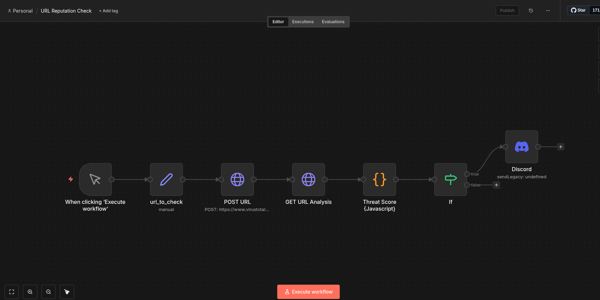

---

## Step 1: Set Up URL Input

Create a new workflow named "URL Reputation Check".

Add a **Manual Trigger**, then a **Set** node:
- Field name: `url_to_check`
- Type: String
- Value: `https://example-malicious-site.com/phishing` (test URL)

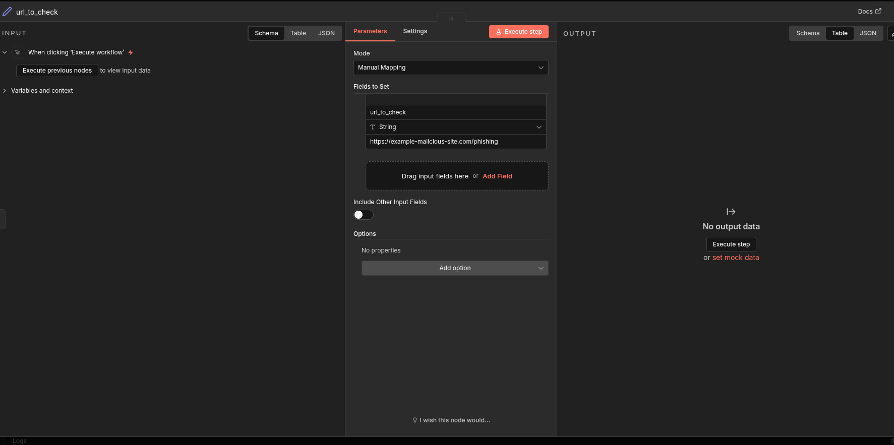

---

## Step 2: Submit URL to VirusTotal (POST)

Unlike IPs, URLs need to be submitted first. Add an **HTTP Request** node:

- **Method:** POST
- **URL:** `https://www.virustotal.com/api/v3/urls`
- **Authentication:** Header Auth (your VirusTotal credential)
- **Send Body:** ON
- **Body Content Type:** Form-Urlencoded
- **Body Fields:**
  - Name: `url`
  - Value: `{{ $json.url_to_check }}`

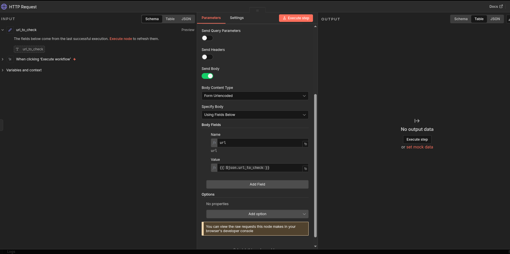

This returns an analysis ID that we'll use to fetch the results.

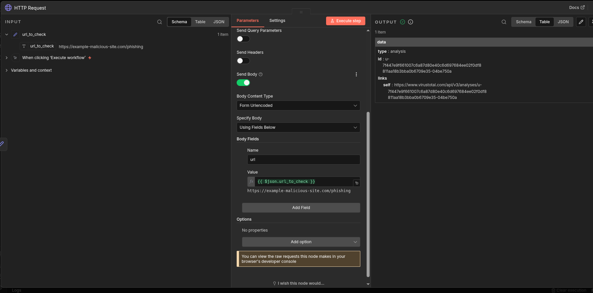

---

## Step 3: Retrieve Analysis Results (GET)

Add another **HTTP Request** node to fetch the analysis:

- **Method:** GET
- **URL:** `https://www.virustotal.com/api/v3/analyses/{{ $json.data.id }}`
- **Authentication:** Same Header Auth credential

The `{{ $json.data.id }}` pulls the analysis ID from the previous POST response.

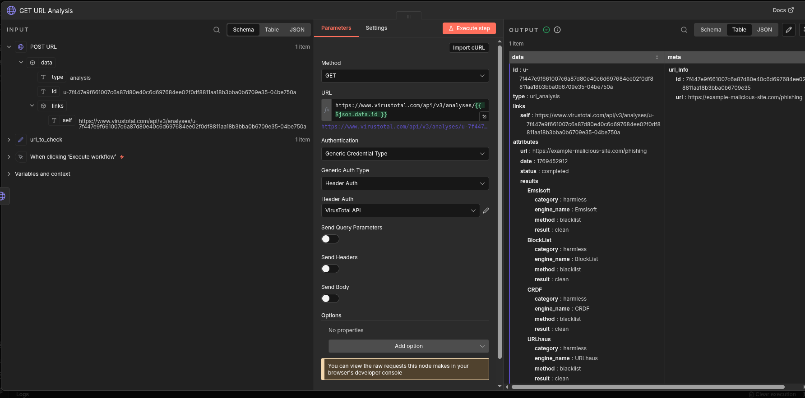

---

## Step 4: Calculate Threat Score with Defang Function

Add a **Code** node. This version includes a defang function to make URLs safe for sharing in alerts.

```javascript
const data = $input.first().json.data.attributes;
const stats = data.stats;

// Defang URL for safe sharing
function defangUrl(url) {
  return url
    .replace(/https:\/\//gi, 'hxxps://')
    .replace(/http:\/\//gi, 'hxxp://')
    .replace(/\./g, '[.]');
}

// Calculate threat score
const totalVendors = stats.malicious + stats.suspicious + stats.harmless + stats.undetected;
const threatScore = Math.round(((stats.malicious * 100) + (stats.suspicious * 50)) / totalVendors);

// Risk level based on malicious detection count
let riskLevel;
if (stats.malicious >= 5) {
  riskLevel = 'HIGH';
} else if (stats.malicious >= 2) {
  riskLevel = 'MEDIUM';
} else {
  riskLevel = 'LOW';
}

return {
  url: data.url,
  urlDefanged: defangUrl(data.url),
  threatScore: threatScore,
  malicious: stats.malicious,
  suspicious: stats.suspicious,
  harmless: stats.harmless,
  riskLevel: riskLevel
};
```

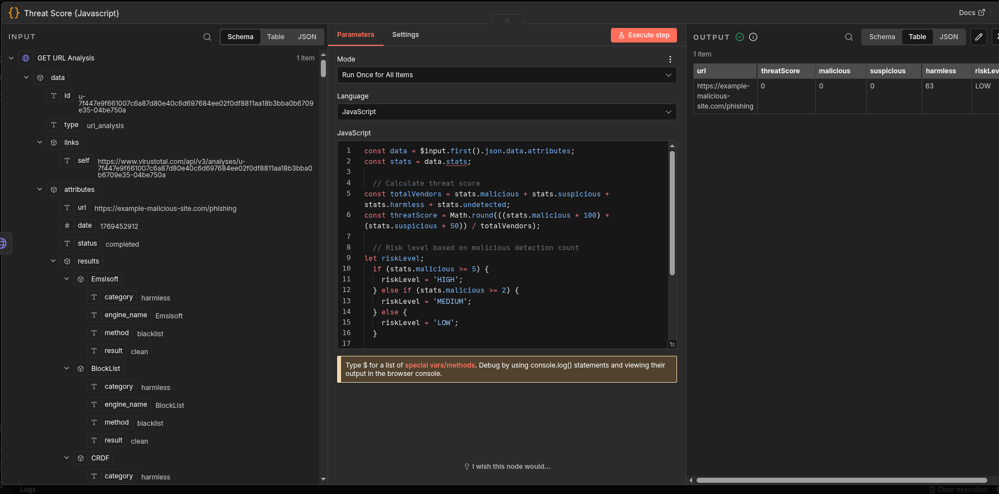

### Why Defang URLs?

When sharing malicious URLs in alerts, you don't want anyone accidentally clicking them. Defanging converts:
- `https://` → `hxxps://`
- `http://` → `hxxp://`
- `.` → `[.]`

Example: `https://malware.com/bad` becomes `hxxps://malware[.]com/bad`

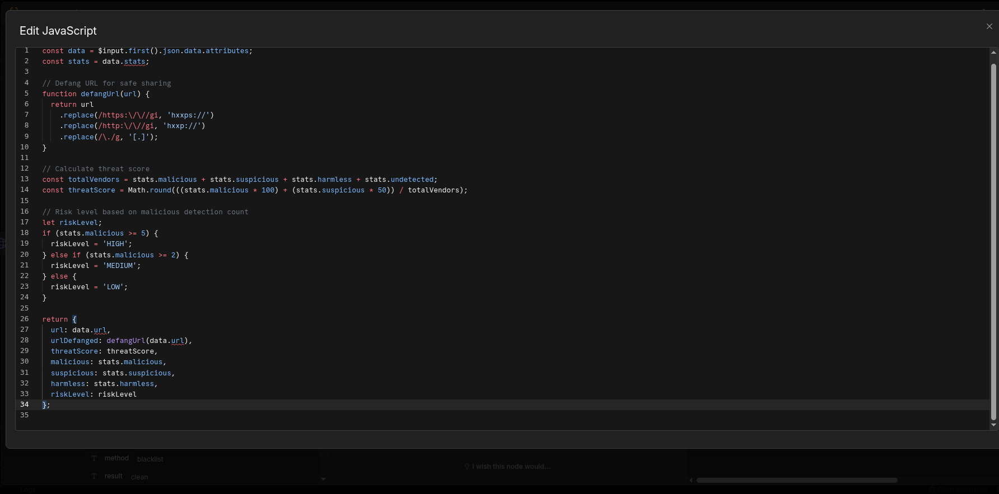

---

## Step 5: Route by Risk Level

Add an **IF** node:
- Condition: `{{ $json.riskLevel }}` equals `HIGH`

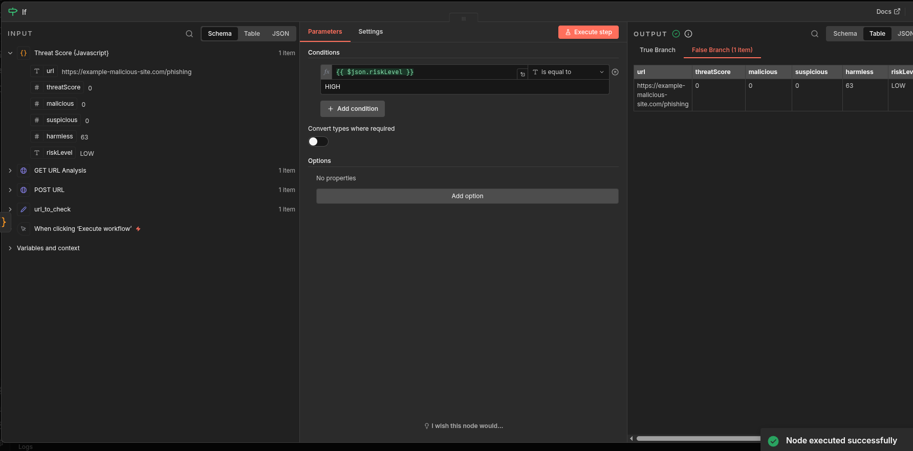

---

## Step 6: Discord Alert with Defanged URL

Add a **Discord** node on the TRUE branch:
- Connection Type: Webhook
- Credential: Your Discord webhook

**Message:**
```
**URL Flagged:** {{ $json.urlDefanged }}
**Threat Score:** {{ $json.threatScore }}/100
**Risk Level:** {{ $json.riskLevel }}
**Malicious Detections:** {{ $json.malicious }}
```

Note: Use `urlDefanged` instead of `url` so the link isn't clickable.

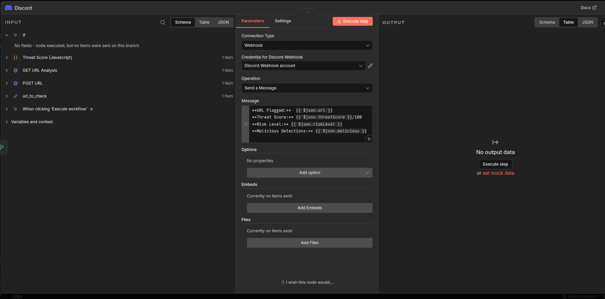

---

## Step 7: Testing

### Finding a Malicious URL to Test

Unlike IPs, there's no standard "test malicious URL" that all vendors flag. Options:

1. **URLhaus** (abuse.ch) - Public feed of malware URLs
2. **Temporarily force HIGH** - Change `if (stats.malicious >= 5)` to `if (true)` for testing

I tested with a URL from URLhaus: `http://87.106.54.213/bins/spc`

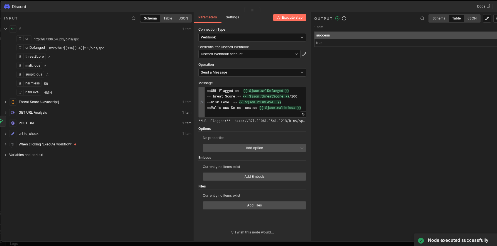

The alert shows the defanged URL: `hxxp://87[.]106[.]54[.]213/bins/spc`

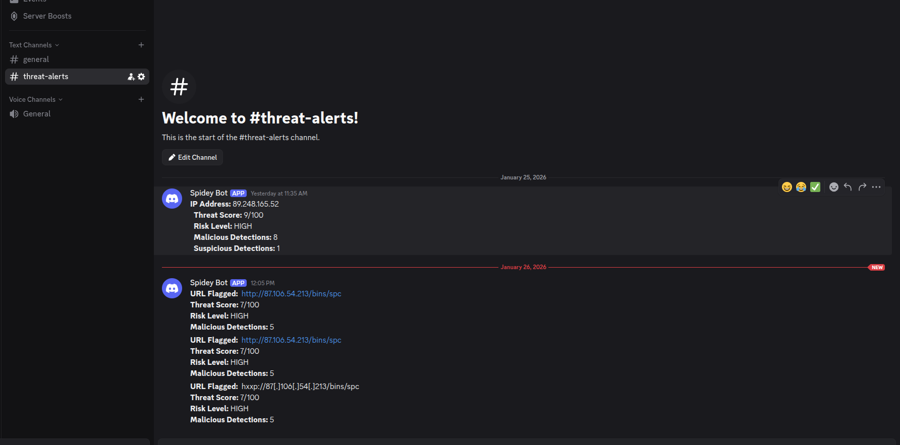

---

## Bonus: Add Defang to IP Workflow

After implementing this, I went back and added defanging to the IP workflow too:

```javascript
function defangIp(ip) {
  return ip.replace(/\./g, '[.]');
}
```

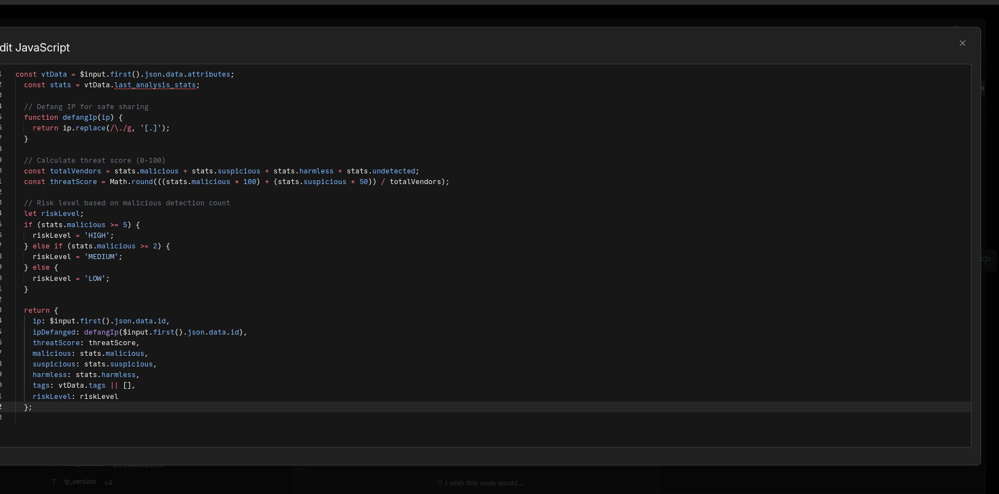

Result: `89.248.165.52` → `89[.]248[.]165[.]52`

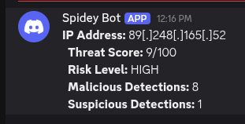

---

## Workflow Summary

| Node | Purpose |
|------|---------|
| Manual Trigger | Start workflow |
| Set (url_to_check) | Hold URL to analyze |
| HTTP Request (POST) | Submit URL to VirusTotal |
| HTTP Request (GET) | Retrieve analysis results |
| Code (Threat Score) | Calculate risk + defang URL |
| IF | Route HIGH risk to alerting |
| Discord | Send defanged alert |

---

## Key Differences from IP Workflow

| Aspect | IP Workflow | URL Workflow |
|--------|-------------|--------------|
| API Method | Single GET | POST then GET |
| Data Path | `data.attributes.last_analysis_stats` | `data.attributes.stats` |
| Defanging | Replace `.` with `[.]` | Replace protocol + `.` |

---

## Files

- `workflows/url-reputation-check.json` - Exported workflow
- `docs/workflow-build-guide.md` - IP Reputation workflow guide
