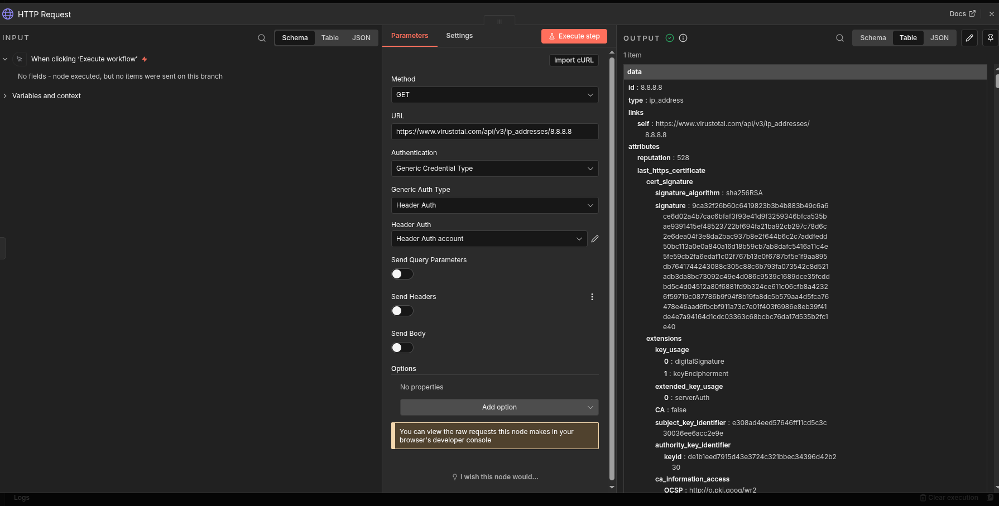
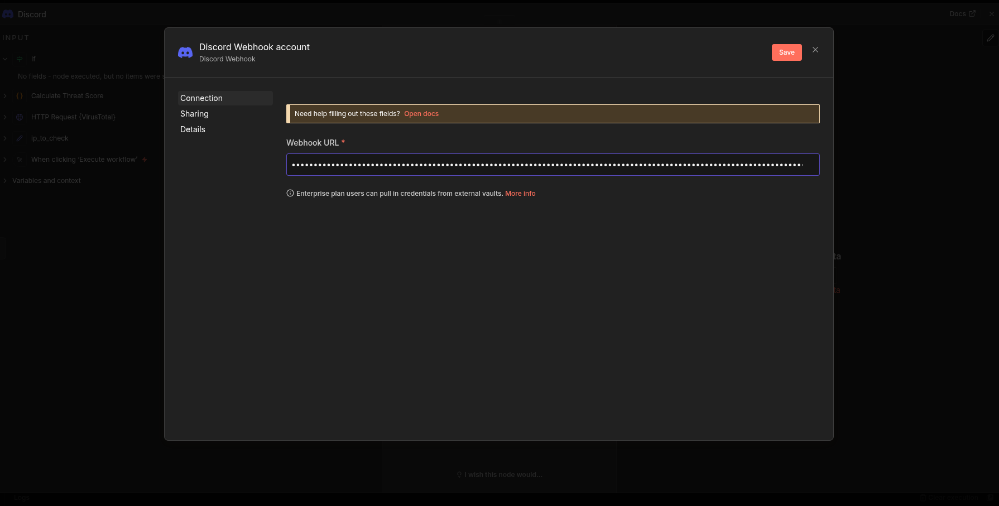
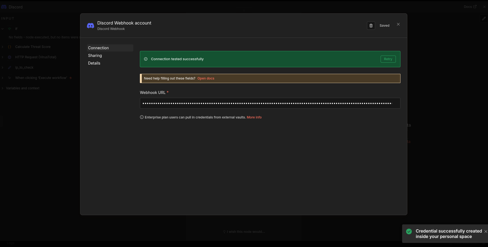
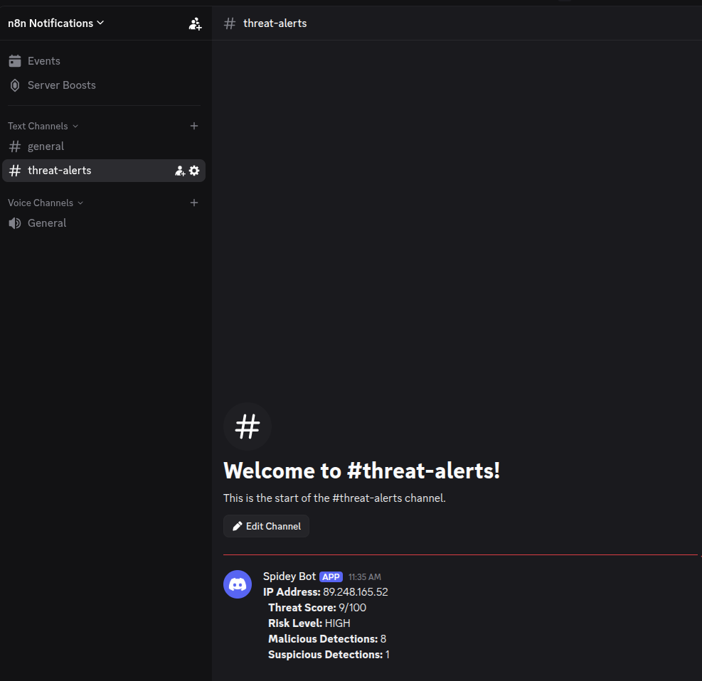

# Building an IP Reputation Check Workflow in n8n

This guide walks through building an automated IP reputation workflow that checks IPs against VirusTotal and sends Discord alerts for high-risk threats. I'll cover the build process, the decisions made along the way, and an important lesson learned about threshold tuning.

**Prerequisites:** n8n running locally (see [setup.md](setup.md) for installation)

---

## Overview

**What we're building:**
- Manual trigger → Set IP → VirusTotal API → Calculate threat score → Route by risk level → Discord alert

**Why this workflow:**
- Demonstrates API integration with threat intelligence
- Shows conditional routing based on calculated risk
- Practical notification system for security alerts


---

## Step 1: Create the Workflow

In n8n, click **+ Create Workflow** and name it something like "IP Reputation Check".

Add a **Manual Trigger** node - this lets us test the workflow on demand. In production, you'd swap this for a webhook that receives IPs from your SIEM or email gateway.

---

## Step 2: Set Up the IP Input

Add a **Set** node after the trigger. This holds the IP address we want to check.

1. Click **Add Field**
2. Name: `ip_to_check`
3. Value: Start with a test IP like `8.8.8.8` (Google DNS - known safe)

Later we'll use known malicious IPs to test the alerting.

---

## Step 3: VirusTotal API Integration

### Get Your API Key
1. Sign up at [virustotal.com](https://www.virustotal.com/)
2. Go to your profile → API Key
3. Copy your API key (free tier works fine for testing)

### Create the Credential in n8n
Add an **HTTP Request** node and configure authentication:

1. Authentication: **Generic Credential Type**
2. Generic Auth Type: **Header Auth**
3. Click the pencil to create a new credential
4. Name: `x-apikey`
5. Value: Your VirusTotal API key


### Configure the Request
- Method: **GET**
- URL: `https://www.virustotal.com/api/v3/ip_addresses/{{$json.ip_to_check}}`

The `{{$json.ip_to_check}}` pulls the IP from the previous Set node dynamically.

### Test It
Run the workflow. You should see a response with `last_analysis_stats` showing malicious, suspicious, harmless, and undetected counts.



---

## Step 4: Calculate Threat Score

The raw VirusTotal response has a lot of data. We need to process it into something actionable.

Add a **Code** node (JavaScript) after the HTTP Request.


### The Code

```javascript
const vtData = $input.first().json.data.attributes;
const stats = vtData.last_analysis_stats;

// Calculate threat score (0-100)
const totalVendors = stats.malicious + stats.suspicious + stats.harmless + stats.undetected;
const threatScore = Math.round(((stats.malicious * 100) + (stats.suspicious * 50)) / totalVendors);

// Risk level based on malicious detection count
let riskLevel;
if (stats.malicious >= 5) {
  riskLevel = 'HIGH';
} else if (stats.malicious >= 2) {
  riskLevel = 'MEDIUM';
} else {
  riskLevel = 'LOW';
}

return {
  ip: $input.first().json.data.id,
  threatScore: threatScore,
  malicious: stats.malicious,
  suspicious: stats.suspicious,
  harmless: stats.harmless,
  tags: vtData.tags || [],
  riskLevel: riskLevel
};
```


### Important: Why These Thresholds?

This is where I learned something during testing. My original code used percentage-based thresholds:

```javascript
// Original (DON'T USE)
riskLevel: threatScore > 30 ? 'HIGH' : threatScore > 10 ? 'MEDIUM' : 'LOW'
```

**The problem:** VirusTotal checks IPs against 80-90+ vendors. Even clearly malicious IPs rarely get flagged by more than 10-15% of vendors. A known Tor exit node with 8 malicious detections only scored ~10% - which my original logic classified as LOW.

**The fix:** Use raw malicious counts instead of percentages. From my experience doing security analysis, having 5+ vendors independently flag an IP is significant. That's not a false positive - that's a real threat.

| Malicious Detections | Risk Level | Reasoning |
|---------------------|------------|-----------|
| 5+ | HIGH | Multiple vendors flagging = confirmed threat |
| 2-4 | MEDIUM | Worth investigating |
| 0-1 | LOW | Likely false positive or clean |

See [tuning-notes.md](tuning-notes.md) for more detail on this decision.

---

## Step 5: Route by Risk Level

Add an **IF** node to route based on the calculated risk level.

### Configuration
- Condition: `{{ $json.riskLevel }}` **equals** `HIGH`


The TRUE branch goes to alerting. The FALSE branch can go to logging or just end (for now).

---

## Step 6: Discord Alerting

For high-risk IPs, we want an immediate notification. Discord webhooks are simple to set up.

### Create a Discord Webhook
1. In Discord, go to your server → Server Settings → Integrations → Webhooks
2. Click **New Webhook**
3. Name it (e.g., "n8n Threat Alert")
4. Copy the webhook URL

### Add Discord Node in n8n
1. Add a **Discord** node connected to the TRUE branch of the IF node
2. **Connection Type:** Webhook (not Bot Token)
3. Create a credential and paste your webhook URL





### Configure the Message

```
**IP Address:** {{ $json.ip }}
**Threat Score:** {{ $json.threatScore }}/100
**Risk Level:** {{ $json.riskLevel }}
**Malicious Detections:** {{ $json.malicious }}
**Suspicious Detections:** {{ $json.suspicious }}
```


---

## Step 7: Test with a Malicious IP

Time to test the full workflow with a known bad IP.

1. Go back to your **Set** node
2. Change the IP to something like `89.248.165.52` (known scanner) or a Tor exit node
3. Run the workflow

If everything is configured correctly, you should see an alert in your Discord channel:



---

## Workflow Summary

The complete flow:

1. **Manual Trigger** - Starts the workflow
2. **Set (ip_to_check)** - Holds the IP to analyze
3. **HTTP Request** - Calls VirusTotal API
4. **Calculate Threat Score** - Processes response, assigns risk level
5. **IF** - Routes HIGH risk to alerting
6. **Discord** - Sends notification for threats


---

## What's Next

This workflow checks a single IP on demand. To make it production-ready:

- **Webhook trigger** - Accept IPs from external systems (SIEM, email gateway)
- **Additional sources** - Add AbuseIPDB, GreyNoise for corroboration
- **Rate limiting** - VirusTotal free tier has API limits
- **Logging** - Track all checks, not just HIGH risk
- **Email parsing** - Extract IPs/URLs from suspicious emails automatically

---

## Files

- `workflows/ip-reputation-check.json` - Exported workflow (import into n8n)
- `docs/tuning-notes.md` - Detailed notes on threshold tuning
- `docs/setup.md` - n8n installation guide
